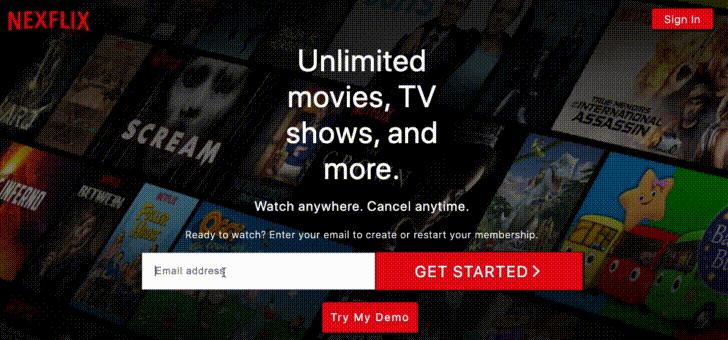
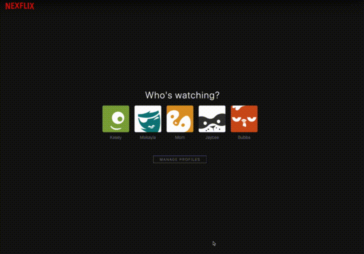

# Nexflex
## My Netflix-Clone
**Browse Movies and Series and view Trailers**
#

# Demonstrations

## sign in or create an account: 

## select your profile:

## and browse the site!! There's plenty to explore:

### an app by:
- Kasey McGee
# App Description
-   Full stack application utilizing crud features and built upon a public api TMDB.
-   A netflix look-alike to emphasize tackling wireframe layout.
-   Movie posters with live trailers organized by category.
# User Stories
-   As a user, I want to be able to sign in to my account for a custom experience.
-   As a user, I would like to browse movies as well as tv shows to see whats available.
-   As a user, I want to see trailers or some sort of preview of a given title.
-   As a user, I want to be able to see my history.
-   As a user, I want to save a selection of movies to go back to.
# Technologies
-   Deployment: Docker / Heroku
-   Frontend UI engine: React / Redux
-   Backend server: Python / Flask
-   RDBMS: PostgresSQL v12
-   ORM: SQLAlchemy 
# Define Database Functionality + Input Data
1.  Store user information including status of session.
  - hashes user password for security.
  - each user has profiles. Profiles at the moment can be viewed or changed on the demo user and integration is in the works for all users.
2.  Store user's history for review and ability to clear all history. 
3.  Store a watchlist to review with ability to remove items from watchlist.

# APIs CRUD Operations
### /api/~
- user/login
- user/logout
- user/register
- user/< id >/history
- user/< id >/history/add 
- user/< id >/history/clear
- user/< id >/watchlist
- user/< id >/watchlist/add
- user/< id >/watchlist/remove
### /api/session/~
- restore
- remove

# Tools
-   VS Code
-   Brave Browser
-   GitHub
-   Coffee!
-   Insomnia
-   TMDB api
-   youtube api
